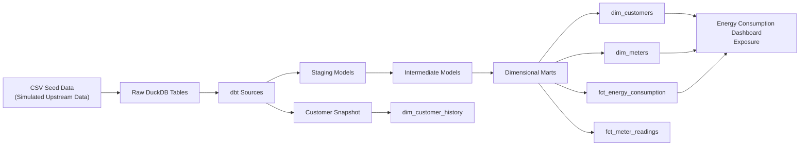
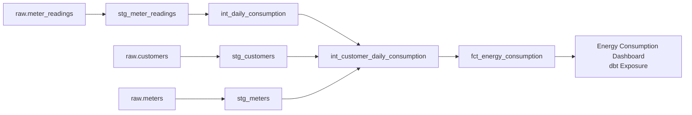
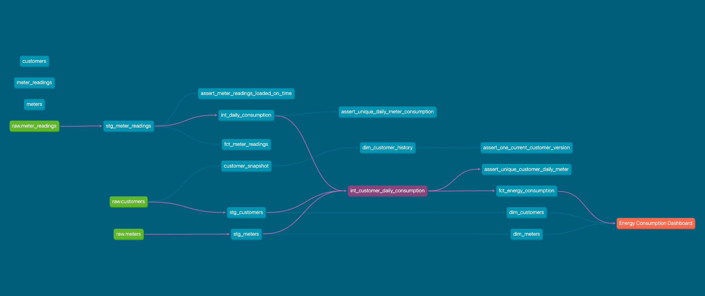

# Energy Analytics Engineering with dbt

**Tech Stack:** dbt · DuckDB · SQL · Python · GitHub Actions

[](https://github.com/ehsieh0715/energy-analytics-dbt/actions/workflows/dbt-ci.yml)

## Table of Contents

- [Overview](#overview)
- [Architecture](#architecture)
- [Data Model](#data-model)
- [Example Lineage](#example-lineage)
- [Key dbt Features](#key-dbt-features)
- [Data Quality & Monitoring](#data-quality--monitoring)
- [Incremental Processing](#incremental-processing)
- [Historical Tracking](#historical-tracking)
- [CI](#ci)
- [Project Structure](#project-structure)
- [How to Run](#how-to-run)
- [Limitations / Production Considerations](#limitations--production-considerations)


## Overview

End-to-end analytics engineering project using dbt and DuckDB to transform raw energy data into tested, documented, analytics-ready dimensional models.

The project simulates an energy supplier data platform with customer, meter, and interval consumption data. CSV files are loaded with dbt seeds for local reproducibility, then registered as `raw` sources to simulate upstream tables that, in a production environment, would be populated by external ingestion pipelines.

The raw sources are transformed through staging and intermediate layers into dimensional marts suitable for downstream BI and analytics.


## Architecture




## Data Model

The mart layer provides dimensional and fact models designed for downstream analytics.

| Model | Type | Grain | Purpose |
|---|---|---|---|
| `dim_customers` | Dimension | One row per customer | Current customer attributes used for analysis and filtering |
| `dim_meters` | Dimension | One row per meter | Meter attributes and customer ownership |
| `dim_customer_history` | SCD Type 2 Dimension | One row per customer version | Historical tracking of customer attribute changes |
| `fct_meter_readings` | Incremental Fact | One row per meter reading | Detailed meter-level consumption events |
| `fct_energy_consumption` | Fact | One row per meter per day | Daily energy consumption metrics for reporting and analysis |

The dimensional marts separate descriptive business entities from measurable events, providing reusable datasets for downstream BI applications.


## Example Lineage
A typical transformation path for energy consumption analytics is:



dbt resolves these dependencies through `source()` and `ref()`, creating an explicit DAG that supports lineage tracking, testing, documentation, and impact analysis.

### dbt Documentation Lineage
The generated dbt documentation provides an interactive view of model dependencies from raw sources through transformation layers to downstream exposures.




## Key dbt Features

- `source()` for raw operational tables
- `ref()` for model dependencies and lineage
- Staging, intermediate, and dimensional mart layers
- Generic, singular, and custom generic data tests
- `dbt_utils` package for reusable tests
- Reusable Jinja macros for staging normalization
- Incremental fact model with `unique_key`
- Lookback window for late-arriving data
- dbt snapshots for SCD Type 2 customer history
- Source freshness monitoring
- Ingestion latency monitoring
- Stored test failures for issue investigation
- GitHub Actions CI for automated dbt validation
- dbt exposure for downstream dashboard lineage


## Data Quality & Monitoring

The project implements multiple layers of validation:

- Source-level integrity checks using `unique`, `not_null`, and `relationships`
- Staging-level value standardization and `accepted_values`
- Custom reusable `non_negative` test for consumption metrics
- Composite grain validation using `dbt_utils.unique_combination_of_columns`
- SCD2 validation ensuring one current customer version
- Source freshness monitoring using `loaded_at`
- Ingestion latency testing between event time and warehouse load time
- Stored failure records for investigation


## Incremental Processing

`fct_meter_readings` is implemented as an incremental model using `reading_id` as the unique key.

A lookback window reprocesses recent source records to capture late-arriving and corrected readings while avoiding a full historical rebuild on every run.


## Historical Tracking

Customer attribute changes are tracked using a dbt snapshot with SCD Type 2 logic.

The historical customer dimension preserves previous versions of customer attributes using:

- `customer_version_id`
- `valid_from`
- `valid_to`
- `is_current`


## CI

GitHub Actions validates the dbt project automatically on pushes and pull requests, with support for manual workflow runs via `workflow_dispatch`.

The workflow:

1. Installs Python and dbt dependencies
2. Installs dbt packages
3. Validates the dbt profile
4. Loads seed data
5. Runs the full dbt build


## Project Structure

```text
energy-analytics-dbt/
├── .github/
│   └── workflows/
│       └── dbt-ci.yml
├── docs/
│   └── images/
│       └── dbt-lineage.png
├── energy_analytics/
│   ├── macros/
│   │   └── normalize_text.sql
│   ├── models/
│   │   ├── staging/
│   │   │   ├── _sources.yml
│   │   │   ├── _staging_models.yml
│   │   │   ├── stg_customers.sql
│   │   │   ├── stg_meters.sql
│   │   │   └── stg_meter_readings.sql
│   │   ├── intermediate/
│   │   │   ├── _intermediate_models.yml
│   │   │   ├── int_daily_consumption.sql
│   │   │   └── int_customer_daily_consumption.sql
│   │   └── marts/
│   │       ├── dimensions/
│   │       │   ├── dim_customers.sql
│   │       │   ├── dim_meters.sql
│   │       │   └── dim_customer_history.sql
│   │       ├── facts/
│   │       │   ├── fct_meter_readings.sql
│   │       │   └── fct_energy_consumption.sql
│   │       ├── _marts_models.yml
│   │       └── _exposures.yml
│   ├── seeds/
│   │   ├── customers.csv
│   │   ├── meters.csv
│   │   └── meter_readings.csv
│   ├── snapshots/
│   │   └── customer_snapshot.yml
│   ├── tests/
│   │   ├── generic/
│   │   │   └── test_non_negative.sql
│   │   ├── assert_meter_readings_loaded_on_time.sql
│   │   ├── assert_one_current_customer_version.sql
│   │   ├── assert_unique_customer_daily_meter.sql
│   │   └── assert_unique_daily_meter_consumption.sql
│   ├── scripts/
│   │   └── inspect_duckdb.py
│   ├── dbt_project.yml
│   ├── package-lock.yml
│   ├── packages.yml
│   └── profiles.yml
├── requirements.txt
└── README.md
```

### Layer Responsibilities

- `staging/` — source-aligned cleaning, type casting, and standardisation
- `intermediate/` — reusable transformations and business logic
- `marts/` — dimensional models and analytics-ready fact tables
- `snapshots/` — historical change tracking using SCD Type 2
- `tests/` — custom generic and singular tests for reusable validation and business-specific data quality rules
- `macros/` — reusable Jinja macros for transformation logic
- `scripts/` — local DuckDB inspection and failed-test investigation utilities
- `.github/workflows/` — automated CI validation
- `docs/images/` — portfolio documentation assets and generated lineage screenshots


## How to Run

Create and activate a virtual environment:

```bash
python3 -m venv .venv
source .venv/bin/activate
```

Install dependencies:
```bash
pip install -r requirements.txt
```

Enter the dbt project and install packages:
```bash
cd energy_analytics
dbt deps
```

Validate the local DuckDB profile:
```bash
dbt debug --profiles-dir .
```

Load the simulated upstream data into DuckDB:
```bash
dbt seed --profiles-dir .
```

Build and validate the full dbt DAG:
```bash
dbt build --profiles-dir .
```

Run source freshness monitoring:
```bash
dbt source freshness --profiles-dir .
```

Generate documentation:
```bash
dbt docs generate --profiles-dir .
dbt docs serve --profiles-dir .
```


## Limitations / Production Considerations
This project uses dbt seeds and DuckDB to provide a reproducible local environment. Seeded tables are registered as `raw` dbt sources to simulate externally ingested upstream data.

In a production environment:

- raw tables would be populated by ingestion pipelines from operational systems rather than dbt seeds
- dbt `source()` definitions would reference those externally managed raw tables
- `loaded_at` would be populated by the ingestion pipeline
- source freshness would run as part of scheduled production monitoring
- pipeline execution history and failures would be monitored through an orchestration platform
- downstream BI tools such as Power BI would consume certified mart models
- the dashboard exposure represents an example downstream BI consumer; a production implementation would link the exposure to an actual BI asset